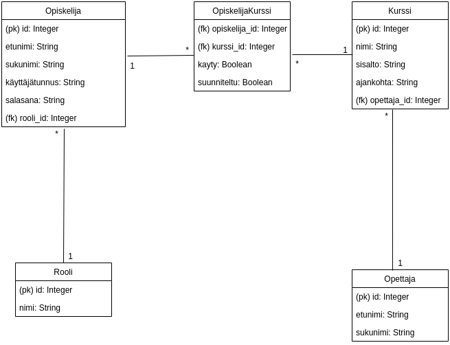

## Create Table- lauseet

```
CREATE TABLE teacher (
	id INTEGER NOT NULL, 
	firstname VARCHAR(144) NOT NULL, 
	lastname VARCHAR(144) NOT NULL, 
	PRIMARY KEY (id)
)

CREATE TABLE account (
	id INTEGER NOT NULL, 
	firstname VARCHAR(144) NOT NULL, 
	lastname VARCHAR(144) NOT NULL, 
	username VARCHAR(144) NOT NULL, 
	password VARCHAR(144) NOT NULL, 
	role_id INTEGER NOT NULL, 
	PRIMARY KEY (id), 
	FOREIGN KEY(role_id) REFERENCES role (id) ON DELETE cascade
)

CREATE TABLE course (
	id INTEGER NOT NULL, 
	name VARCHAR(144) NOT NULL, 
	content VARCHAR(144) NOT NULL, 
	time VARCHAR(144) NOT NULL, 
	teacher_id INTEGER NOT NULL, 
	PRIMARY KEY (id), 
	FOREIGN KEY(teacher_id) REFERENCES teacher (id) ON DELETE cascade
)

CREATE TABLE account_course (
	user_id INTEGER NOT NULL, 
	course_id INTEGER NOT NULL, 
	completed BOOLEAN NOT NULL, 
	planned BOOLEAN NOT NULL, 
	PRIMARY KEY (user_id, course_id), 
	FOREIGN KEY(user_id) REFERENCES account (id) ON DELETE cascade, 
	FOREIGN KEY(course_id) REFERENCES course (id) ON DELETE cascade, 
	CHECK (completed IN (0, 1)), 
	CHECK (planned IN (0, 1))
)

CREATE TABLE role (
	id INTEGER NOT NULL, 
	role VARCHAR(5) NOT NULL, 
	PRIMARY KEY (id)
)

```
